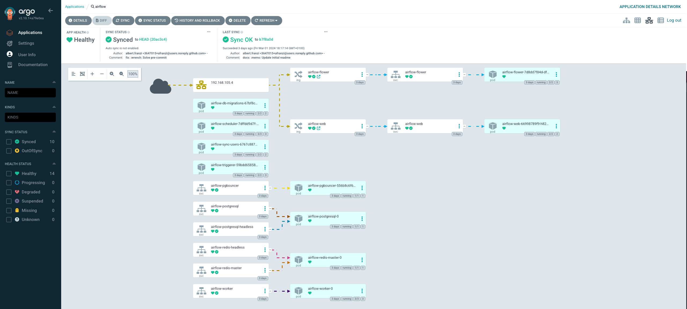

# Airflow

 

!!! tip "Community Chart"
    In our project, we use the [Airflow Community Helm chart](https://artifacthub.io/packages/helm/airflow-helm/airflow)
    to deploy Airflow on our Minikube cluster.

    This chart is our favorite one because it's flexible and easy to use, making it perfect for getting Airflow up
    running in a Kubernetes environment like ours.

---

## Setup

For the actual deployment into our Kubernetes cluster, we're using :simple-argo: **[ArgoCD](https://argo-cd.readthedocs.io)**.
It's a tool that helps us deploy applications automatically, following the best practices of GitOps. This means we can
manage our Airflow setup with code, making changes easily and keeping everything up to date without hassle.

Using ArgoCD not only makes our lives easier by automating deployment tasks but also keeps our project tidy and
well-organized. It's a smart way to handle deployments, giving us more time to focus on making our data platform better.

The most important properties when defining our Airflow values are:

-   :simple-github:{ .lg .middle } __`dags.gitSync.repo`__

    ---

    Github repo containing our Airflow DAGs code.
    Airflow [**dags-git-sync**](https://airflow.apache.org/docs/helm-chart/stable/manage-dags-files.html#using-git-sync9)
    sidecars will be fetching new code periodically from it. So all code pushed there will be automatically deployed.

-   :octicons-code-16:{ .lg .middle } __`dags.gitSync.repoSubPath`__

    ---

    Github folder containing our **DAGs code**. This property is mandatory to use in this project since
    we are defining multiple tools in it (i.e. K8s, terraform, Helms).

---

## Requirements

| Repository | Name | Version |
|------------|------|---------|
| https://airflow-helm.github.io/charts | airflow | 8.8.0 |

## Values

| Key | Type | Default | Description |
|-----|------|---------|-------------|
| airflow.airflow.config.AIRFLOW__API__AUTH_BACKENDS | string | `"airflow.api.auth.backend.basic_auth"` |  |
| airflow.airflow.config.AIRFLOW__CORE__CHECK_SLAS | string | `"False"` |  |
| airflow.airflow.config.AIRFLOW__CORE__DAGS_ARE_PAUSED_AT_CREATION | string | `"True"` |  |
| airflow.airflow.config.AIRFLOW__CORE__MAX_ACTIVE_RUNS_PER_DAG | int | `1` |  |
| airflow.airflow.config.AIRFLOW__CORE__MIN_SERIALIZED_DAG_UPDATE_INTERVAL | int | `150` |  |
| airflow.airflow.config.AIRFLOW__DATABASE__LOAD_DEFAULT_CONNECTIONS | string | `"False"` |  |
| airflow.airflow.config.AIRFLOW__LOGGING__REMOTE_LOGGING | string | `"False"` |  |
| airflow.airflow.config.AIRFLOW__WEBSERVER__AUTHENTICATE | string | `"False"` |  |
| airflow.airflow.config.AIRFLOW__WEBSERVER__BASE_URL | string | `"https://airflow.data"` |  |
| airflow.airflow.config.AIRFLOW__WEBSERVER__ENABLE_PROXY_FIX | string | `"True"` |  |
| airflow.airflow.config.AIRFLOW__WEBSERVER__EXPOSE_CONFIG | string | `"False"` |  |
| airflow.airflow.config.AIRFLOW__WEBSERVER__HIDE_PAUSED_DAGS_BY_DEFAULT | string | `"True"` |  |
| airflow.airflow.executor | string | `"CeleryExecutor"` |  |
| airflow.airflow.image.repository | string | `"apache/airflow"` |  |
| airflow.airflow.image.tag | string | `"2.8.2-python3.10"` |  |
| airflow.createUserJob.applyCustomEnv | bool | `false` |  |
| airflow.createUserJob.useHelmHooks | bool | `false` |  |
| airflow.dags.gitSync.branch | string | `"main"` |  |
| airflow.dags.gitSync.enabled | bool | `true` |  |
| airflow.dags.gitSync.repo | string | `"https://github.com/afranzi/mini-data-platform.git"` |  |
| airflow.dags.gitSync.repoSubPath | string | `"airflow"` |  |
| airflow.dags.gitSync.resources.requests.cpu | string | `"50m"` |  |
| airflow.dags.gitSync.resources.requests.memory | string | `"64Mi"` |  |
| airflow.dags.gitSync.revision | string | `"HEAD"` |  |
| airflow.dags.gitSync.syncWait | int | `60` |  |
| airflow.ingress.apiVersion | string | `"networking.k8s.io/v1"` |  |
| airflow.ingress.enabled | bool | `true` |  |
| airflow.ingress.web.host | string | `"airflow.data"` |  |
| airflow.ingress.web.ingressClassName | string | `"nginx"` |  |
| airflow.migrateDatabaseJob.applyCustomEnv | bool | `false` |  |
| airflow.migrateDatabaseJob.jobAnnotations."argocd.argoproj.io/hook" | string | `"Sync"` |  |
| airflow.migrateDatabaseJob.useHelmHooks | bool | `false` |  |
| airflow.postgresql.enabled | bool | `true` |  |
| airflow.redis.cluster.enabled | bool | `false` |  |
| airflow.redis.cluster.slaveCount | int | `1` |  |
| airflow.redis.enabled | bool | `true` |  |
| airflow.redis.image.tag | string | `"7.2.4-debian-12-r9"` |  |
| airflow.redis.master.persistence.enabled | bool | `false` |  |
| airflow.redis.master.persistence.size | string | `"2Gi"` |  |
| airflow.redis.master.persistence.storageClass | string | `""` |  |
| airflow.redis.master.resources.requests.cpu | string | `"10m"` |  |
| airflow.redis.master.resources.requests.memory | string | `"32Mi"` |  |
| airflow.redis.slave.persistence.enabled | bool | `false` |  |
| airflow.redis.slave.persistence.size | string | `"8Gi"` |  |
| airflow.redis.slave.persistence.storageClass | string | `""` |  |
| airflow.redis.slave.resources.requests.cpu | string | `"10m"` |  |
| airflow.redis.slave.resources.requests.memory | string | `"32Mi"` |  |
| airflow.scheduler.resources.limits.cpu | string | `"1000m"` |  |
| airflow.scheduler.resources.limits.memory | string | `"1Gi"` |  |
| airflow.scheduler.resources.requests.cpu | string | `"1000m"` |  |
| airflow.scheduler.resources.requests.memory | string | `"512Mi"` |  |
| airflow.workers.enabled | bool | `true` |  |
| airflow.workers.logCleanup.enabled | bool | `true` |  |
| airflow.workers.logCleanup.resources.requests.cpu | string | `"10m"` |  |
| airflow.workers.logCleanup.resources.requests.memory | string | `"32Mi"` |  |
| airflow.workers.logCleanup.retentionMinutes | int | `21600` |  |
| airflow.workers.podDisruptionBudget.apiVersion | string | `nil` |  |
| airflow.workers.podDisruptionBudget.enabled | bool | `true` |  |
| airflow.workers.podDisruptionBudget.maxUnavailable | string | `"20%"` |  |
| airflow.workers.replicas | int | `1` |  |
| airflow.workers.resources.requests.cpu | string | `"256m"` |  |
| airflow.workers.resources.requests.memory | string | `"1Gi"` |  |
