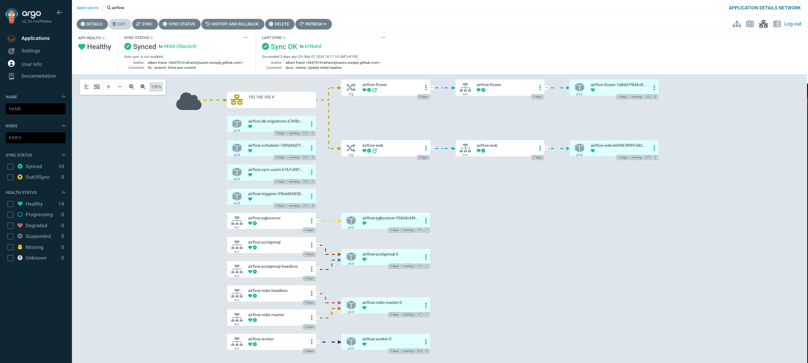

# Airflow

 

!!! tip "Official Apache Chart"
    In our project, we use the [official Apache Airflow Helm chart](https://airflow.apache.org/docs/helm-chart/stable/index.html)
    to deploy Airflow on our Minikube cluster.

    We adopted the upstream-supported chart (Airflow 3.x) so the local platform mirrors the production blueprint.

---

## Setup

For the actual deployment into our Kubernetes cluster, we're using :simple-argo: **[ArgoCD](https://argo-cd.readthedocs.io)**.
It's a tool that helps us deploy applications automatically, following the best practices of GitOps. This means we can
manage our Airflow setup with code, making changes easily and keeping everything up to date without hassle.

Using ArgoCD not only makes our lives easier by automating deployment tasks but also keeps our project tidy and
well-organized. It's a smart way to handle deployments, giving us more time to focus on making our data platform better.

The most important properties when defining our Airflow values are:

-   :simple-github:{ .lg .middle } __`dags.gitSync.repo`__

    ---

    Github repo containing our Airflow DAGs code.
    Airflow [**dags-git-sync**](https://airflow.apache.org/docs/helm-chart/stable/manage-dags-files.html#using-git-sync9)
    sidecars will be fetching new code periodically from it. So all code pushed there will be automatically deployed.

-   :octicons-code-16:{ .lg .middle } __`dags.gitSync.repoSubPath`__

    ---

    Github folder containing our **DAGs code**. This property is mandatory to use in this project since
    we are defining multiple tools in it (i.e. K8s, terraform, Helms).

---

## Requirements

| Repository | Name | Version |
|------------|------|---------|
| https://airflow.apache.org | airflow | 1.22.0 |

## Values

| Key | Type | Default | Description |
|-----|------|---------|-------------|
| airflow.airflowVersion | string | `"3.2.2"` |  |
| airflow.apiSecretKeySecretName | string | `"airflow-config-credentials"` |  |
| airflow.apiServer.resources.limits.cpu | string | `"1000m"` |  |
| airflow.apiServer.resources.limits.memory | string | `"1Gi"` |  |
| airflow.apiServer.resources.requests.cpu | string | `"250m"` |  |
| airflow.apiServer.resources.requests.memory | string | `"512Mi"` |  |
| airflow.config.api.base_url | string | `"https://airflow.data"` |  |
| airflow.config.core.auth_manager | string | `"airflow.api_fastapi.auth.managers.simple.simple_auth_manager.SimpleAuthManager"` |  |
| airflow.config.core.dags_are_paused_at_creation | string | `"True"` |  |
| airflow.config.core.load_examples | string | `"False"` |  |
| airflow.config.core.max_active_runs_per_dag | int | `1` |  |
| airflow.config.core.simple_auth_manager_users | string | `"admin:admin"` |  |
| airflow.config.database.load_default_connections | string | `"False"` |  |
| airflow.config.logging.remote_logging | string | `"False"` |  |
| airflow.createUserJob.enabled | bool | `false` |  |
| airflow.dagProcessor.enabled | bool | `true` |  |
| airflow.dagProcessor.resources.requests.cpu | string | `"100m"` |  |
| airflow.dagProcessor.resources.requests.memory | string | `"256Mi"` |  |
| airflow.dags.gitSync.branch | string | `"main"` |  |
| airflow.dags.gitSync.enabled | bool | `true` |  |
| airflow.dags.gitSync.repo | string | `"https://github.com/afranzi/mini-data-platform.git"` |  |
| airflow.dags.gitSync.rev | string | `"HEAD"` |  |
| airflow.dags.gitSync.subPath | string | `"airflow"` |  |
| airflow.dags.persistence.enabled | bool | `false` |  |
| airflow.data.metadataSecretName | string | `"airflow-metadata"` |  |
| airflow.executor | string | `"CeleryExecutor"` |  |
| airflow.fernetKeySecretName | string | `"airflow-config-credentials"` |  |
| airflow.images.airflow.repository | string | `"apache/airflow"` |  |
| airflow.images.airflow.tag | string | `"3.2.2-python3.12"` |  |
| airflow.ingress.apiServer.enabled | bool | `true` |  |
| airflow.ingress.apiServer.hosts[0].name | string | `"airflow.data"` |  |
| airflow.ingress.apiServer.ingressClassName | string | `"nginx"` |  |
| airflow.ingress.apiServer.path | string | `"/"` |  |
| airflow.ingress.enabled | bool | `true` |  |
| airflow.migrateDatabaseJob.applyCustomEnv | bool | `false` |  |
| airflow.migrateDatabaseJob.enabled | bool | `true` |  |
| airflow.migrateDatabaseJob.jobAnnotations."argocd.argoproj.io/hook" | string | `"Sync"` |  |
| airflow.migrateDatabaseJob.useHelmHooks | bool | `false` |  |
| airflow.postgresql.enabled | bool | `false` |  |
| airflow.redis.enabled | bool | `true` |  |
| airflow.redis.persistence.enabled | bool | `false` |  |
| airflow.scheduler.resources.limits.cpu | string | `"1000m"` |  |
| airflow.scheduler.resources.limits.memory | string | `"1Gi"` |  |
| airflow.scheduler.resources.requests.cpu | string | `"250m"` |  |
| airflow.scheduler.resources.requests.memory | string | `"512Mi"` |  |
| airflow.triggerer.enabled | bool | `true` |  |
| airflow.triggerer.persistence.enabled | bool | `false` |  |
| airflow.triggerer.replicas | int | `1` |  |
| airflow.triggerer.resources.requests.cpu | string | `"100m"` |  |
| airflow.triggerer.resources.requests.memory | string | `"256Mi"` |  |
| airflow.workers.persistence.enabled | bool | `false` |  |
| airflow.workers.replicas | int | `1` |  |
| airflow.workers.resources.requests.cpu | string | `"256m"` |  |
| airflow.workers.resources.requests.memory | string | `"1Gi"` |  |
