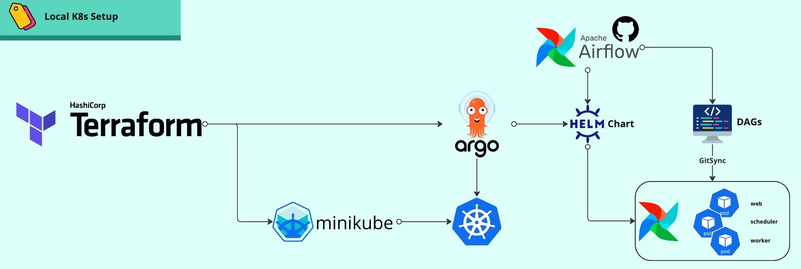

# The Mini Data Platform
## The concept

In the evolving landscape of data management and infrastructure automation, the ability to efficiently deploy and manage
data platforms is essential for any organization looking to leverage data-driven insights.
The mini data platform cluster project that embodies the spirit of innovation and learning in the fields of
Infrastructure as Code (IaC), Data Engineering, and Operations (Ops).

{ align=left }

At the heart of this project lies a carefully curated stack comprising Terraform, Minikube, ArgoCD, and Airflow.
Each tool has been selected for its strength in automating and managing infrastructure, orchestrating deployments, and
scheduling complex workflows, respectively. Together, they form a robust framework that enables users to deploy a
miniature yet fully-functional data platform cluster with ease.

!!! tip annotate "Learning purpose"
    This project serves a dual purpose. Firstly, it is a **practical guide** that demonstrates the simplicity and
    efficiency of using modern DevOps tools to **set up a data platform**. Secondly, it acts as a **learning platform**
    for enthusiasts and professionals alike who wish to deepen their understanding and enhance their skills
    in **IaC**(1), **Data Engineering**, and **Ops**.

1. **IaC**: Infrastructure as Code

-   :simple-kubernetes:{ .lg .middle } __[Kubernetes (K8s)](https://kubernetes.io/)__

    ---

    Define architecture in a serverless approach
    and running in minutes

-   :simple-terraform:{ .lg .middle } __[Terraform](https://www.terraform.io/)__

    ---

    Learn how to define Infrastructure as Code

    [:octicons-arrow-right-24: Getting started](terraform/main)

-   :simple-argo:{ .lg .middle } __[ArgoCD](https://argo-cd.readthedocs.io)__

    ---

    Declarative & GitOps continuous delivery tool for Kubernetes.

-   :simple-apacheairflow:{ .lg .middle } __[Airflow](https://airflow.apache.org/)__

    ---

    Define & orchestrate Data Pipelines

---

## Literature

This section compiles a selection of articles and resources that were invaluable in the development of the mini data
platform cluster project. It features links to comprehensive readings on Terraform, Minikube, ArgoCD, and Airflow, each
chosen for its clear explanations, practical advice, and relevance to integrating and utilizing these tools effectively.
We extend our gratitude to the authors of these resources for their insights and contributions to the community.

- [Installing ArgoCD on Minikube and deploying a test application](https://medium.com/@mehmetodabashi/installing-argocd-on-minikube-and-deploying-a-test-application-caa68ec55fbf)

!!! tip ":octicons-heart-fill-24: Acknowledge"
    We acknowledge and appreciate the effort and expertise of each author whose work has guided us. As our project grows and
    adapts, we will continue to update this section with new findings and articles that reflect our ongoing learning journey
    and the contributions of experts in the field.
